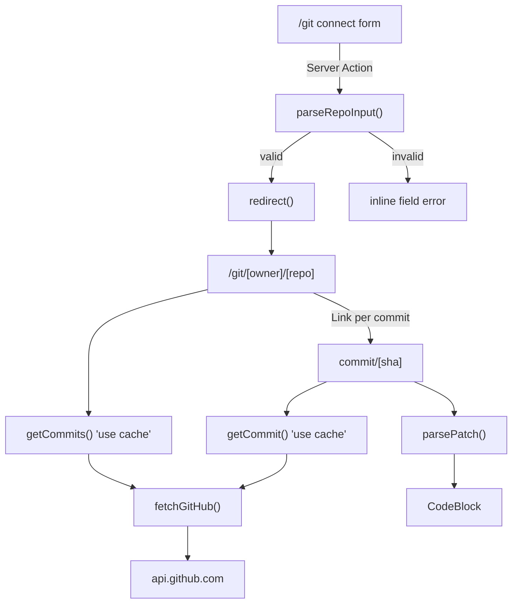

# Git Commit Viewer Design

Date: 2026-07-31
Status: Approved

## Purpose

Let a user point the app at a public GitHub repository and read its commit
history, rendering each commit's per-file diff through the existing `CodeBlock`
component. The feature lives entirely under the `/git` route.

## Scope Decisions

These were settled during brainstorming and are fixed for this spec.

- **Data source:** the unauthenticated GitHub REST API (`api.github.com`) against
  public repositories. No OAuth, no personal access tokens from users.
- **"Connected" state:** none. The repository identity lives in the URL, which
  makes every screen shareable and leaves nothing to invalidate.
- **Diff rendering:** the unified `patch` string from GitHub is parsed. Leading
  `+`/`-`/space markers are stripped, the remaining text is highlighted with the
  file's real language, and `th-line--inserted` / `th-line--deleted` decorations
  colour the changed rows.
- **Rate limits:** mitigated by aggressive `use cache` lifetimes, plus an
  optional `GITHUB_TOKEN` environment variable that raises the ceiling from 60 to
  5,000 requests per hour when present.
- **Verification:** no test runner is added. Correctness is verified manually in
  the browser alongside `pnpm check-types` and `pnpm lint`.

### Out of Scope

Branch and tag switching (the repository's default branch is always used), file
tree browsing, full-file content views, private repositories, and any
authentication.

## Screens

| Route | Purpose |
| --- | --- |
| `/git` | Form to enter a repository, which redirects to that repository |
| `/git/[owner]/[repo]` | Repository header and paginated commit list |
| `/git/[owner]/[repo]/commit/[sha]` | Commit metadata and one `CodeBlock` per changed file |

The commit detail route uses an explicit `commit` segment rather than
`/git/[owner]/[repo]/[sha]` so the namespace stays open for future segments such
as `tree` or `blob`.

All three share `app/git/layout.tsx`, which supplies the page shell: the centred
`main` wrapper matching the treatment in `app/components/(main)/layout.tsx`, and a
breadcrumb built from `@repo/ui/components/breadcrumb`. The layout is
synchronous and reads no data, because a layout that awaited `params` would need
its own `Suspense` boundary under Cache Components; the breadcrumb instead derives
its segments on the client from `usePathname`.

### `/git` — Connect

A `Card` containing a single text field and a submit button. The field accepts
any of:

- `https://github.com/owner/repo` (with or without a trailing slash or `.git`)
- `git@github.com:owner/repo.git`
- `owner/repo`

Submission calls a Server Action. On a successful parse the action redirects to
`/git/[owner]/[repo]`. On a parse failure it returns a message that the form
renders inline; it does not redirect and does not throw.

### `/git/[owner]/[repo]` — Commit List

A header showing the repository's full name, description, default branch, and
star count, followed by a list of commits. Each row shows the commit message
subject, the author's avatar and name, a relative timestamp, and the short SHA,
and links to that commit's detail page.

Pagination is driven by a `?page=` search parameter with a fixed page size of 30.
Because the GitHub commits endpoint does not report a total count, "next" is
offered whenever the response contains a full page of results, and "previous"
whenever `page > 1`.

### `/git/[owner]/[repo]/commit/[sha]` — Commit Detail

The full commit message, author and committer, authored date, the SHA, and the
additions/deletions totals from the API's `stats` object. Below that, one
`CodeBlock` per changed file. Each block uses the file path as its `title` and
the detected language as its `lang`, which drives the badge the component already
renders in its header.

## Data Flow



## Modules

The risky logic is isolated into pure functions with no framework or network
dependencies, so each can be reasoned about and exercised on its own.

### `lib/github/client.ts`

Exports `fetchGitHub<T>(path)`. Responsibilities:

- Prefix `https://api.github.com`.
- Send `Accept: application/vnd.github+json` and
  `X-GitHub-Api-Version: 2022-11-28`.
- Attach `Authorization: Bearer <token>` only when `process.env.GITHUB_TOKEN` is
  set.
- Return a discriminated union rather than throwing, so each caller decides what
  is fatal:

```ts
type GitHubResult<T> =
  | { status: 'ok'; data: T }
  | { status: 'not-found' }
  | { status: 'rate-limited'; resetAt: Date | null }
  | { status: 'error'; message: string }
```

A 403 or 429 carrying `x-ratelimit-remaining: 0` maps to `rate-limited`, with
`resetAt` derived from the `x-ratelimit-reset` header. A 404 maps to
`not-found`. Other non-OK responses and thrown network errors map to `error`.

### `lib/github/commits.ts`

Three cached async functions, each taking plain string arguments:

- `getRepo(owner, repo)`
- `getCommits(owner, repo, page)`
- `getCommit(owner, repo, sha)`

Each carries `'use cache'`, calls `cacheTag(\`repo:${owner}/${repo}\`)`, and
returns the `GitHubResult` from the client unchanged.

Cache lifetimes reflect how the underlying data behaves. A commit list changes as
work lands, so `getRepo` and `getCommits` use `cacheLife('minutes')`. A commit
addressed by its SHA is immutable, so `getCommit` uses `cacheLife('max')`. This
asymmetry is the main defence against the request ceiling.

Those lifetimes apply to successful responses only. Caching a `rate-limited` or
`error` result for a long window would outlast the condition that produced it,
and `cacheLife('max')` would persist a transient failure effectively forever. So
each function selects its lifetime conditionally, which the directive supports:

```ts
export async function getCommit(owner: string, repo: string, sha: string) {
  'use cache'
  cacheTag(`repo:${owner}/${repo}`)

  const result = await fetchGitHub<GitHubCommitDetail>(
    `/repos/${owner}/${repo}/commits/${sha}`,
  )

  // A commit is immutable once it exists; a failure is not.
  cacheLife(result.status === 'ok' ? 'max' : 'seconds')

  return result
}
```

`getRepo` and `getCommits` follow the same shape, falling back to `'seconds'`
instead of `'minutes'` when the result is not `ok`.

Only the fields the UI consumes are typed, in `lib/github/types.ts`, rather than
modelling the full API payloads.

### `lib/github/parse-repo-input.ts`

Pure. `parseRepoInput(input: string)` returns `{ owner, repo }` or
`{ error: string }`. It trims whitespace, strips a `.git` suffix and any trailing
slash, accepts the three input shapes listed under the `/git` screen, and
validates each segment against GitHub's naming rules so that a malformed value
cannot become a request path.

### `lib/diff/parse-patch.ts`

Pure, and the most delicate piece. `parsePatch(patch: string)` returns:

```ts
type ParsedPatch = {
  code: string
  decorations: HighlightDecoration[]
}
```

Behaviour, line by line over the patch:

- A line beginning `@@` is kept verbatim as a separator row and receives a
  `th-line--highlighted` decoration.
- A line beginning `+` has that first character removed and receives
  `th-line--inserted`.
- A line beginning `-` has that first character removed and receives
  `th-line--deleted`.
- A line beginning with a single space has that character removed and receives no
  decoration.
- A `\ No newline at end of file` marker is dropped entirely.

Line numbers in decorations are one-based and inclusive, matching the
highlighter's contract. Consecutive lines sharing a class are merged into a
single `{ lines: [start, end] }` decoration rather than emitting one decoration
per line.

The resulting gutter numbers are diff-relative, not true file line numbers. This
is a deliberate trade: the highlighter's `lineNumbers` option is a plain boolean
with no offset, so true dual gutters would require a custom gutter implementation.

### `lib/diff/language-for-filename.ts`

Pure. Maps a file path to one of the highlighter's registered language names by
extension, with special cases for extensionless well-known files such as
`Dockerfile`. Anything unrecognised returns `plaintext`.

### `lib/highlight.ts` (modified)

Currently registers only `html`, `css`, and `tsx`. Commits touch arbitrary file
types, so this expands to every language `@tanstack/highlight@0.0.9` ships:
`apache`, `css`, `diff`, `dockerfile`, `ejs`, `env`, `html`, `http`, `js`,
`json`, `jsx`, `markdown`, `mermaid`, `nginx`, `plaintext`, `python`, `scheme`,
`shell`, `sql`, `svelte`, `toml`, `ts`, `tsrx`, `tsx`, `vue`, and `yaml`. It also
sets `fallbackLanguage: 'plaintext'` so an unregistered extension degrades to
unhighlighted text instead of failing. The existing `highlightCss` export is
unchanged.

Note that the set does not cover every language a repository might contain: Go,
Rust, Java, C, and C++ files will render as plain text. That is acceptable, since
the diff row decorations carry the important signal and do not depend on the
language.

### `components/git/`

- `repo-form.tsx` — client component wiring the Server Action through
  `useActionState` so validation messages render without a navigation.
- `git-breadcrumb.tsx` — client component deriving breadcrumbs from
  `usePathname`.
- `repo-header.tsx` — async component rendering repository metadata.
- `commit-list.tsx` — async component rendering the rows and the pager.
- `commit-detail.tsx` — async component rendering commit metadata and the file
  list.
- `file-diff.tsx` — takes one changed file, resolves the language, calls
  `parsePatch`, passes the result to `createHighlightedCodeBlockProps`, and
  renders `CodeBlock`.
- `rate-limit-notice.tsx` — the shared rate-limit state.
- `skeletons.tsx` — `Suspense` fallbacks built from `@repo/ui/components/skeleton`.

All UI is assembled from existing `@repo/ui` primitives (`Card`, `Item`,
`ItemGroup`, `Badge`, `Avatar`, `Breadcrumb`, `Empty`, `Field`, `Input`,
`Button`, `Skeleton`). No new UI primitives are added.

The pager uses `Button` with `render={<Link />}` rather than the `Pagination`
primitives. `PaginationLink` renders a bare `<a>`, which would cause a full page
load and bypass typed-route checking; the `Button` plus `Link` combination is
already the established pattern in `app/components/(main)/layout.tsx`.

## Rendering Model

The app sets `cacheComponents: true` and `typedRoutes: true` in
`apps/web/next.config.ts`, which constrains how these pages must be written.

Under Cache Components, `params` and `searchParams` are request-time data. Any
component that awaits them must sit inside a `<Suspense>` boundary or the build
fails with a blocking-route error. Therefore each page component stays
synchronous and passes the unawaited promises down to async children:

```tsx
export default function Page({ params, searchParams }: PageProps<'/git/[owner]/[repo]'>) {
  return (
    <>
      <Suspense fallback={<RepoHeaderSkeleton />}>
        <RepoHeader params={params} />
      </Suspense>
      <Suspense fallback={<CommitListSkeleton />}>
        <CommitList params={params} searchParams={searchParams} />
      </Suspense>
    </>
  )
}
```

Two further consequences of this Next.js version:

- The removed route segment config exports (`dynamic`, `revalidate`,
  `fetchCache`) are not used anywhere. Caching is expressed only through
  `'use cache'` and `cacheLife`.
- Values built at runtime cannot satisfy the `Route` type directly, so commit
  links cast with `as Route`, imported from `next`.

## Error Handling

Expected, recoverable states are rendered as UI. Only genuine failures throw.

| Condition | Handling |
| --- | --- |
| Unparseable repository input | Inline form message via `useActionState`; no redirect |
| GitHub 404 for repo or commit | `notFound()`, caught by `not-found.tsx` under the repo segment |
| Rate limited | An `Empty` state naming the reset time; never thrown, so the reset detail survives |
| Network failure or 5xx | Thrown, surfacing in `app/git/error.tsx` |
| File with no `patch` (binary or oversized) | A notice in place of the `CodeBlock` |
| Commit exceeding GitHub's 300-file response cap | A truncation note below the file list |

`app/git/error.tsx` is a client component whose props are
`{ error, unstable_retry }`. This version of Next.js replaced the older `reset`
prop with `unstable_retry`, which re-fetches rather than only clearing error
state.

## Discoverability

The home page at `apps/web/app/page.tsx` currently renders only the text "Home".
A link to `/git` is added there so the feature is reachable without typing a URL.

## Files

New:

- `apps/web/app/git/page.tsx`
- `apps/web/app/git/layout.tsx`
- `apps/web/app/git/actions.ts`
- `apps/web/app/git/error.tsx`
- `apps/web/app/git/[owner]/[repo]/page.tsx`
- `apps/web/app/git/[owner]/[repo]/not-found.tsx`
- `apps/web/app/git/[owner]/[repo]/commit/[sha]/page.tsx`
- `apps/web/lib/github/client.ts`
- `apps/web/lib/github/commits.ts`
- `apps/web/lib/github/types.ts`
- `apps/web/lib/github/parse-repo-input.ts`
- `apps/web/lib/diff/parse-patch.ts`
- `apps/web/lib/diff/language-for-filename.ts`
- `apps/web/components/git/repo-form.tsx`
- `apps/web/components/git/git-breadcrumb.tsx`
- `apps/web/components/git/repo-header.tsx`
- `apps/web/components/git/commit-list.tsx`
- `apps/web/components/git/commit-detail.tsx`
- `apps/web/components/git/file-diff.tsx`
- `apps/web/components/git/rate-limit-notice.tsx`
- `apps/web/components/git/skeletons.tsx`

Modified:

- `apps/web/lib/highlight.ts` — register all languages, set `plaintext` fallback
- `apps/web/app/page.tsx` — link to `/git`
- `README.md` — document the optional `GITHUB_TOKEN`

## Success Criteria

1. Entering `vercel/next.js`, its HTTPS URL, or its SSH URL on `/git` lands on
   that repository's commit list.
2. The commit list renders 30 commits with author, message, relative date, and
   short SHA, and paginates forward and back.
3. Opening a commit renders every changed file in a `CodeBlock` with the file
   path in the header, correct language highlighting, and green/red row shading
   on the changed lines.
4. A nonexistent repository or SHA shows the not-found UI, not a stack trace.
5. Exhausting the rate limit shows the reset-time state rather than an error
   boundary.
6. `pnpm check-types` and `pnpm lint` both pass.
