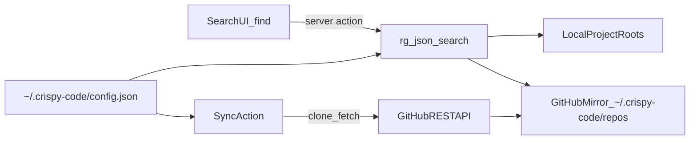

# Code Finder: search code across all your past projects

## Problem

You remember writing a piece of code but cannot recall which project it is in or where the file lives. Code Finder provides one quick search box over all your historical projects.

## Product goals

- Keep setup simple: local roots + selected GitHub repos.
- Keep search fast: ripgrep over real files, no heavyweight index.
- Keep results practical: snippet, path, project, and one-click actions.

## Scope and decisions

- Sources include both local folders and GitHub repositories.
- Search supports keyword and regex now.
- Semantic/AI search is explicitly deferred to phase 2.
- Architecture uses ripgrep over local projects plus shallow GitHub mirrors.

## Architecture

- `apps/web/app/find/` contains route pages and server actions.
- `~/.crispy-code/config.json` stores source configuration.
- `~/.crispy-code/repos/<owner>/<repo>` stores shallow mirror clones.
- Search uses `@vscode/ripgrep` and parses `--json` output.
- Search must honor each source project `.gitignore` by default and must never pass flags that disable ignore behavior.

## Complete feature list

### Sources

- Add and remove local project folders, with existence validation.
- Connect GitHub username/org and select repositories to include.
- Sync selected repos with per-repo state: cloned, syncing, failed, last synced.
- Show onboarding guidance when no sources are configured.

### Search

- Single debounced search input.
- Toggles for regex, case sensitivity, and whole-word search.
- Filters for project, file extension/language, and path substring.
- Recent searches for quick reruns.
- Respects `.gitignore` so ignored files never appear.

### Results

- Grouped by project.
- Snippet with syntax highlighting and highlighted matched text.
- Match counts per project and total count.
- Per-project truncation with show-more behavior.
- Full-file view opened at the matched line.

### Result actions

- Copy snippet text.
- Copy file path.
- Open in editor via `cursor://file/...` and `vscode://file/...`.
- Helpful no-results state with recovery suggestions.

## Error handling

- Per-repo clone/sync failures do not block other repos.
- GitHub API rate-limit notices follow the existing `/git` behavior.
- Missing local roots produce source-level warnings, not global failure.

## Testing and verification

- No unit tests by request.
- Manual smoke testing only:
  - configure at least one local root,
  - sync at least one GitHub repo,
  - confirm `.gitignore` files are excluded from results,
  - open file view and editor deep links from results.

## Implementation notes

- Follow existing `/git` route conventions for layout and actions.
- Reuse existing code rendering primitives (`CodeBlock` and copy button).
- Respect Next.js 16 behavior with server/client boundaries and server actions.
