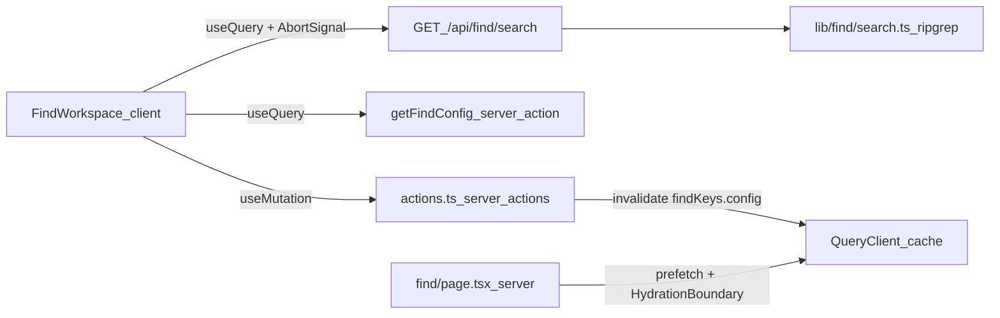

# TanStack Query integration

## Problem

The Code Finder does all client-side data work by hand: Server Action calls wrapped in `useTransition`/`useActionState`, manual `useState` merging for config, and a hand-rolled debounce with no request cancellation or caching. Fast typing queues serial search actions on the server (each running ripgrep) with no way to abort stale ones, and `/find` renders with a hardcoded empty config instead of the real one.

## Goals

- Install TanStack Query app-wide with an SSR-safe provider.
- Migrate the Code Finder fully: reads via `useQuery`, writes via `useMutation` with cache invalidation.
- Make search-as-you-type cancellable and cacheable.
- Fix `/find` to load the real config server-side with no empty flash.

## Scope and decisions

- Approach: hybrid. Search reads move to a GET route handler (parallel, abortable via `AbortSignal`); mutations stay as Server Actions wrapped in `useMutation`.
- The Git viewer stays server-component based and is out of scope.
- Query owns server state only. Input text, mode, filters, and other UI state stay as plain React state.
- GitHub repo lookup is modeled as a mutation (imperative, submit-triggered), not a query.

## Architecture

### Dependencies (apps/web)

- `@tanstack/react-query`
- `@tanstack/react-query-devtools` (regular dependency, imported in `providers.tsx`; excluded from production bundles automatically)

### New files

| File | Purpose |
|---|---|
| `apps/web/app/providers.tsx` | Client component with `QueryClientProvider` and devtools. SSR-safe client creation: fresh `QueryClient` per server request, lazy browser singleton (not `useState` alone). Defaults: `staleTime: 30_000`, `retry: 1`. |
| `apps/web/lib/find/keys.ts` | Query key factory: `findKeys.config()`, `findKeys.search(params)`. Single source of truth for invalidation. |
| `apps/web/app/api/find/search/route.ts` | GET route handler wrapping the existing ripgrep search in `lib/find/search.ts`. Parses and validates query params; returns the same `SearchResponse` JSON. |
| `apps/web/lib/find/search-client.ts` | Typed fetcher for the search endpoint that forwards Query's `AbortSignal` to `fetch`. |

### Modified files

- `apps/web/app/layout.tsx` — mount `Providers` alongside `ThemeProvider`.
- `apps/web/app/find/page.tsx` — prefetch config via `getFindConfigData` (currently unused) into a server-side `QueryClient`, wrap `FindWorkspace` in `HydrationBoundary`. Removes the hardcoded empty `initialConfig`.
- `apps/web/components/find/find-workspace.tsx` — the main migration (see data flow).
- `apps/web/app/find/actions.ts` — add a `getFindConfig` read action; retire the `searchCode` action (replaced by the route handler); small return-shape tweaks only if they simplify cache updates.

## Data flow

### Config query

- `useQuery({ queryKey: findKeys.config() })` replaces the `config` `useState` as the source of truth for local roots, GitHub repos, and recent searches.
- `queryFn` calls the `getFindConfig` Server Action. Config reads are infrequent, so serial-action semantics are fine here.
- Server-prefetched on `/find`, so the first render is populated and not refetched within `staleTime`.

### Search query

- `useQuery({ queryKey: findKeys.search(params), enabled: <query non-empty> })` where `params` is the normalized bundle: query text, mode, case sensitivity, whole word, extension, path filter, source filter, max results.
- The 220ms debounce remains, as a debounced value feeding the query key.
- `queryFn` fetches `GET /api/find/search` and forwards the `AbortSignal`, so stale keystrokes cancel in-flight requests. Query handles deduping and out-of-order protection.
- `placeholderData: keepPreviousData` keeps current results visible while the next results load; `isPlaceholderData` drives a subtle loading indicator.
- Repeat searches within `staleTime` resolve from cache instantly.

### Recent searches

- The search response continues to return `recentSearches` (the route handler records them, as the action does today).
- After a successful search, an effect merges them into the config cache via `queryClient.setQueryData(findKeys.config(), ...)` — no extra round trip. (Query v5 removed `onSuccess` on queries; an effect is the idiomatic place.)

### Mutations

Each remaining Server Action gets a `useMutation`:

- `addLocalRoot`
- `lookupGitHubRepos`
- `setGitHubRepoSelection`
- `syncGitHubRepo`
- `removeSource`

The config-changing mutations (`addLocalRoot`, `setGitHubRepoSelection`, `syncGitHubRepo`, `removeSource`) invalidate `findKeys.config()` on success; `syncGitHubRepo` and `removeSource` also invalidate the `findKeys.search` scope, since cached results may reference changed sources. `lookupGitHubRepos` only returns data for the selection step and invalidates nothing. The `useActionState`/`useTransition` plumbing and manual `setConfig` merges are removed; pending UI comes from `mutation.isPending`.

## Error handling

- Route handler: 400 with a message for malformed params, 500 for search failures. The fetcher throws typed errors so `useQuery`'s `error` renders in the existing error slot.
- Mutations: actions keep their current discriminated result shapes; action-level failures (for example git errors) render as today from mutation results.

## Testing and verification

No test framework exists in the repo; verification is manual against the dev server:

1. `/find` loads with config populated server-side, no empty flash.
2. Fast typing cancels in-flight search requests (visible in the network tab); results never arrive out of order.
3. Repeating a recent search within 30s resolves instantly from cache.
4. Add, remove, and sync sources refresh the source list without a page reload.
5. Recent searches update after each search.
6. Devtools panel shows the expected query keys.
7. `pnpm build` and Biome lint pass.

## Implementation notes

- Follow the official TanStack Query SSR/hydration pattern for the App Router.
- Read the bundled Next.js 16 docs (`node_modules/next/dist/docs/`, pnpm store path) before writing route handler and hydration code; this Next version differs from training data (for example, `searchParams` are Promises and `fetch` is uncached by default).
