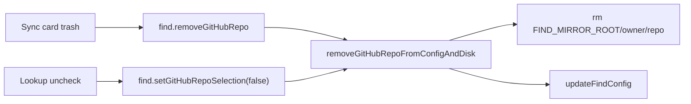

# Delete saved GitHub repos from Find

## Problem

Find lets users select GitHub repos and sync mirrors under `~/.crispy-code/repos/`, but once selected there is no clear way to remove them without re-running a GitHub lookup and unchecking. Uncheck already drops the entry from config via `setGitHubRepoSelection(selected: false)`, yet it leaves the on-disk mirror behind. Local folder sources already have an obvious trash control; GitHub mirrors do not.

## Goals

- Delete a saved GitHub repo from Find config **and** remove its local mirror from disk.
- Expose delete from both the mirror sync card (trash) and the Sources lookup checkbox (uncheck).
- Keep both paths identical via a shared server helper.
- Stay on the existing oRPC + TanStack Query surface; no confirmation dialog.

## Non-goals

- Soft-delete / deferred cleanup of mirrors
- Confirmation modals or undo
- Changing local-root remove behavior (still config-only; those paths are user folders)
- Bulk delete UI

## Architecture

Shared server helper `removeGitHubRepoFromConfigAndDisk(id)` used by:

1. New procedure `find.removeGitHubRepo` — input `{ id: string }`, output `void`
2. Existing `find.setGitHubRepoSelection` when `selected: false` — calls the same helper

### Helper responsibilities

Helper input: `{ id, owner?, repo? }` (owner/repo optional when the config entry is present).

1. Read config and find the repo by `id`. Prefer `owner`/`repo` from the config entry; fall back to input `owner`/`repo` when the entry is already gone (covers uncheck after a concurrent remove).
2. If neither config nor input yields `owner`/`repo`, succeed as a no-op (idempotent).
3. Resolve mirror path as `path.join(FIND_MIRROR_ROOT, owner, repo)`, then verify the resolved path stays under `FIND_MIRROR_ROOT` (reject otherwise).
4. Delete the mirror directory if present (`fs.rm` recursive + force). Missing mirror is success.
5. Best-effort remove an empty `{owner}` directory under the mirror root.
6. Persist config with that repo removed from `githubRepos` (no-op filter if already absent).

**Ordering:** resolve path → delete mirror → update config. If mirror delete fails when a path was resolved, do **not** remove config so the user can retry. If config update fails after a successful disk delete, surface the error; a retry remains safe (idempotent).

### Procedure surface

| Procedure | Change |
|---|---|
| `find.removeGitHubRepo` | **New** — `{ id }` → void; looks up owner/repo from config |
| `find.setGitHubRepoSelection` | On `selected: false`, call helper with `{ id, owner, repo }` from input. On `selected: true`, unchanged. |

## UI & data flow

### `GitHubMirrorSyncCard`

- Each saved-repo row gets a trash icon button, matching local-root rows in `FindWorkspace`.
- `useMutation(orpc.find.removeGitHubRepo)` invalidates `getConfig` and `search` on success.
- Disable trash while remove (or sync) is pending.
- Clear any per-repo sync status message for the deleted id.

### `FindWorkspace` lookup checkboxes

- Keep calling `setGitHubRepoSelection`; server-side `selected: false` now also wipes disk.
- Client success handling stays the same (update `repoResults` selected flags + invalidate config).

No confirm dialog. Success is silent list update, consistent with local-root remove.

## Errors

| Case | Behavior |
|---|---|
| Repo id not in config | Success (idempotent); still wipe disk if caller supplied owner/repo |
| Mirror already absent | Success after config remove |
| Mirror delete fails (e.g. permissions) | Fail with a clear typed error; config left intact |
| Path escapes `FIND_MIRROR_ROOT` | Reject; no delete |
| Config write fails after disk delete | Surface error; retry is safe |

## Verification

Manual checks (no new test harness unless Find already has procedure tests at the same level):

1. Select + sync a repo → trash it → gone from sync list, mirror folder removed, search no longer includes it.
2. Select a repo → uncheck in lookup → config entry and mirror removed the same way.
3. Delete an unsynced selection (never synced) → config removed, no error if mirror missing.
4. Delete twice / already-removed id → no error.

## Out of scope follow-ups

- Cleaning orphaned mirrors not referenced by config
- Showing disk size / mirror path in the UI
