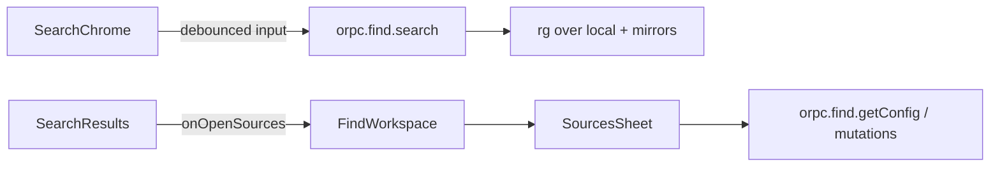

# Find page redesign: search-first layout

## Problem

`/find` currently leads with Sources and GitHub sync cards, pushing search below the fold. Filter controls are dense (sources, extension, path contains, whole word, recent searches) and compete with the primary job: searching code.

## Goals

- Make search the main focus of the page.
- Move Sources and GitHub sync into a toggleable side sheet.
- Simplify filters to query mode, case sensitivity, and a path glob.
- Decompose the Find UI into smaller components with clear boundaries.
- Deliver a modern, minimal UI: quiet chrome, clear hierarchy, no dashboard clutter.

## Non-goals

- Semantic/AI search
- Changing ripgrep ignore behavior or mirror storage layout
- New automated test suite for Find
- Redesigning the `/find/file` viewer

## Decisions

| Topic | Decision |
| --- | --- |
| Layout approach | Decompose into focused components, then recompose the page (not a from-scratch rewrite of business logic) |
| Sources / Sync UI | One **Sources** button opens a right side sheet with tabs: Sources \| Sync |
| Search chrome | Unified search control group (query + filters in one light bordered surface) |
| Literal / Regex | Compact segmented toggle (not a Select) |
| Case sensitive | Keep |
| Visual language | Modern / minimal (see Visual direction) |
| Removed filters | Whole word, sources filter, recent searches, path contains, extension — full removal from UI, API, and config |
| Path filter | Single optional `pathGlob` string passed to `rg --glob` |
| Empty sources | Empty state in results with CTA that opens the Sources sheet (no auto-open) |

## Visual direction

Modern and minimal — one calm composition, not a settings dashboard.

### Principles

- **Search first:** Large, uncluttered query field is the dominant element. Filters are secondary and visually quieter.
- **Light structure, not cards:** Prefer a single hairline-bordered search surface. Avoid stacked `Card` / `CardHeader` / `CardTitle` chrome on the main page. Results are a flat list with subtle separators, not nested bordered cards unless needed for interaction.
- **Quiet chrome:** Sources is a ghost/outline text (or icon+label) button, not a primary CTA. No badge clusters, stat strips, or decorative panels in the first viewport.
- **Spacing over boxes:** Use whitespace and typography hierarchy instead of backgrounds, shadows, and nested containers.
- **Restrained controls:** Compact Literal/Regex toggle; case + path glob on one low-contrast row. No pill clusters.
- **Sheet as utility:** Sources sheet can use slightly denser form UI (still clean tabs, no heavy card nesting inside the sheet).
- **Motion:** Optional short sheet open/close and search pending indicator only — no decorative animation.
- **Avoid:** Multi-layer shadows, glow, dense icon rows, purple/gradient “AI” looks, emoji, and dashboard-style grids on `/find`.

### Main page look

```
+---------------------------------------------+
| Code Finder                      Sources    |  <- title + quiet text button
|                                             |
|  _________________________________________  |
| | Search code...                          | |  <- large input, minimal border
| |-----------------------------------------| |
| | Literal | Regex    Case    Path glob... | |  <- quiet secondary row
|  -----------------------------------------  |
|                                             |
| project-a                          3 matches|
|   path/file.ts:42                           |  <- flat results, hairline rules
|   matched line snippet                      |
|   path/other.ts:10                          |
| project-b                          1 match  |
+---------------------------------------------+
```

### Sheet look

- Right sheet, full height, simple header “Sources”, close control.
- Underline or minimal tabs (Sources | Sync) — not card-in-card.
- Forms use standard fields/buttons; lists are plain rows with trash actions.

## Components

### `FindWorkspace`

- Page shell: title, Sources trigger, sheet open state, optional default tab.
- Composes `SearchChrome`, `SearchResults`, and `SourcesSheet`.
- Passes `onOpenSources()` into search empty-state CTA.

### `SearchPanel` (optional thin wrapper)

- Owns debounced query + filter state and the `orpc.find.search` query.
- Renders `SearchChrome` (controlled inputs) and `SearchResults` (response UI).
- May live as its own file or remain inlined inside `FindWorkspace` if the file stays small.

### `SearchChrome`

- Single light bordered surface (not a titled Card) containing:
  - Large query input (borderless inside the group, or minimal field)
  - Compact Literal / Regex segmented toggle
  - Case sensitive control
  - Path glob input (placeholder like `**/*.{ts,tsx}`)
- Presentational/controlled: does not call the search RPC itself.

### `SearchResults`

- Extracted from current `SearchCard` results UI, restyled as a flat list:
  - pending indicator (subtle)
  - search error / missing-sources warnings (inline, not heavy cards)
  - no-matches empty
  - grouped matches with quiet project headers; match rows use hairline separators
  - keep actions (copy, open in editor, file link) compact — icon buttons preferred over bulky outline buttons where possible
  - no-sources empty with text CTA -> `onOpenSources()`
- Does not render Sources/Sync setup forms.

### `SourcesSheet`

- Right side sheet (`Sheet` from UI package); utility surface, not a mini-dashboard.
- Tabs: **Sources** | **Sync** (minimal tab styling).
- Sources panel: current local-root add/remove + GitHub owner lookup / selection (moved out of `FindWorkspace`).
- Sync panel: current `GitHubMirrorSyncCard` behavior (sync all / per-repo status / trash) without wrapping in an extra Card inside the sheet.
- Existing oRPC mutations remain; only placement changes.

`SearchCard` is retired in favor of `SearchChrome` + `SearchResults` (or becomes a thin re-export during the move, then deleted).

## Search API and config changes

### Search input (keep)

- `query: string`
- `mode: 'literal' | 'regex'`
- `caseSensitive: boolean`
- `pathGlob: string` (optional; empty = no glob filter)

### Search input (remove)

- `wholeWord`
- `extension`
- `pathFilter` (substring contains)
- `sourceFilter`

### Search response (remove)

- `recentSearches`
- `sourceOptions` (only existed for the sources filter UI)

Keep `groups`, `totalMatches`, and `missingSources`.

### Ripgrep

- When `pathGlob` is non-empty after trim, pass `--glob <pathGlob>`.
- Remove `--word-regexp`, extension `--glob *ext`, and post-filter path substring matching.
- Remove `sourceFilter` narrowing in `searchAcrossSources` (always search all available sources).

### Config

- Remove `recentSearches` and `MAX_RECENT_SEARCHES` from Find config schema and service updates.
- Stop updating recent searches on successful search.
- Existing `config.json` entries with `recentSearches` are dropped on parse/write via normal Zod object stripping (no dedicated migration step).

## Data flow



- Config prefetch on the Find page stays as-is.
- Search remains a TanStack Query against `orpc.find.search`.

## Error handling

- Config load failure: banner at top of workspace.
- Search failure: inline under the search card.
- Missing source roots: amber notice in results (unchanged).
- GitHub rate limits and sync failures: unchanged, shown inside the sheet tabs.

## Verification

Manual smoke only:

1. Open `/find` — search control is primary; page feels sparse/minimal; no Sources/Sync cards in the main column.
2. Sources button opens sheet; both tabs work.
3. Add a local root; select and sync a GitHub repo from the sheet.
4. With no sources, empty CTA opens the sheet.
5. Literal vs Regex toggle and case sensitive affect results.
6. Path glob `**/*.ts` (or similar) narrows paths; clearing it restores broader results.
7. Removed controls are gone from UI; search RPC no longer accepts the removed fields.

## Implementation notes

- Prefer existing `@repo/ui` primitives: `Sheet`, `Tabs`, `ToggleGroup`, `Input`, `Button`. Use `Card` sparingly (prefer none on the main Find surface).
- Preserve current editor deep links and result grouping behavior.
- Follow Next.js guidance in `node_modules/next/dist/docs/` where route/server boundaries are touched.
- Ignore `.superpowers/` brainstorm artifacts in git (already added to `.gitignore`).
