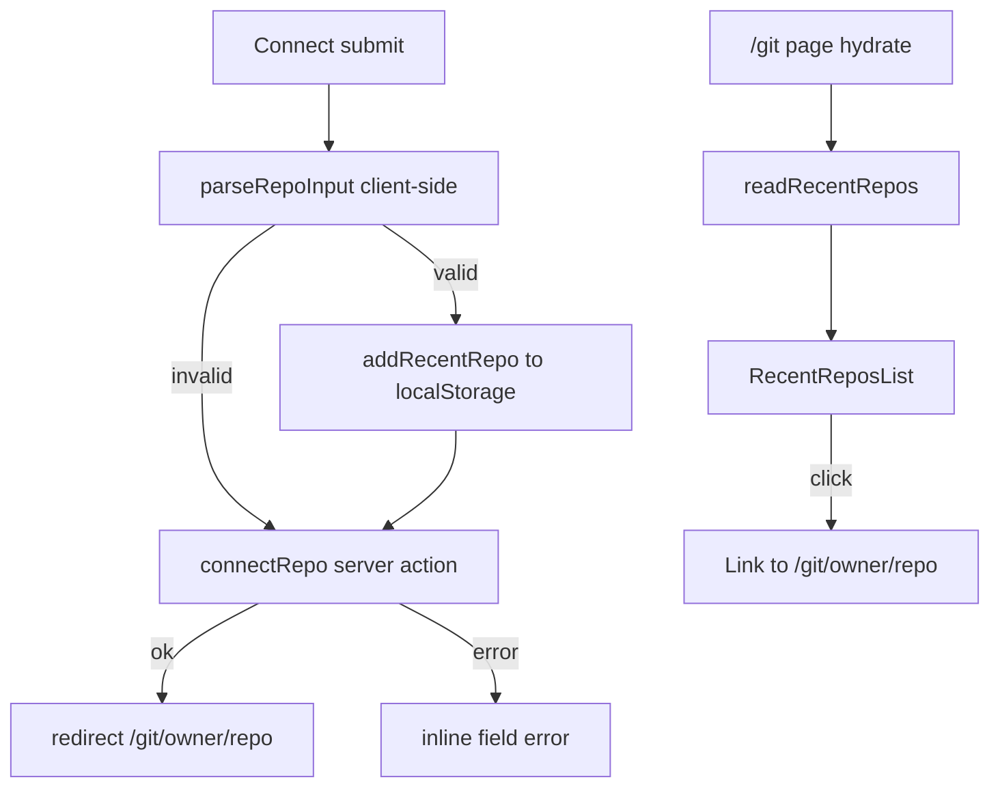

# Recent GitHub repos on /git

## Problem

The `/git` connect page is a blank form every visit. Users who return to browse the same public repositories must re-type `owner/repo` (or a URL) each time. There is no browser-local history of successful connects.

## Goals

- Persist the last 8 successfully connected repositories in `localStorage`.
- Show that list under the Connect Card on `/git`.
- Clicking an entry navigates straight to `/git/[owner]/[repo]`.
- Store normalized `owner/repo` strings only (newest first, duplicates move to front).

## Non-goals

- Clear-all or per-item remove controls (oldest drop off at the cap)
- Persisting failed / unparsed form input
- Recording visits that did not go through Connect (direct URL, breadcrumb, links)
- Cookies, server-rendered list, or cross-device sync
- Showing the list on `/git/[owner]/[repo]` or commit detail routes
- Changing Find’s recent-search behavior (server config, unrelated)

## Architecture

**Storage key:** `crispy-code:git:recent-repos`

**Value:** JSON array of strings (`owner/repo`), max 8, newest first.

**Module:** `apps/web/features/github/recent-repos.ts`

| Helper | Responsibility |
|---|---|
| `readRecentRepos()` | Parse localStorage; corrupt/missing → `[]` |
| `writeRecentRepos(list)` | Serialize and store |
| `addRecentRepo(list, owner, repo)` | MRU prepend, dedupe, `slice(0, 8)` |

Use a small Zod schema (or equivalent resilient parse) on read so bad JSON never throws into the UI.

**Save path:** On form submit, the client runs `parseRepoInput` on the field value. If it succeeds, write the MRU list, then let the form proceed to `connectRepo` (which re-parses and redirects). If client parse fails, do not write — still submit so the existing server-action error path renders the message.

**SSR:** List is client-only. First paint may be empty until hydrate; empty state stays hidden (no placeholder).

## UI

**Page layout (`app/git/page.tsx`):** Wrap the Connect Card and the recent list in a centered column (`max-w-md`, `justify-self-center`) so the list aligns with the Card width.

**`RecentReposList` (client component):** Sibling below the Card — not inside it.

- Hidden when the list is empty (including pre-hydrate)
- Label: `Recent:`
- Each entry: Next.js `Link` to `/git/{owner}/{repo}`, styled like Find’s recent outline chips, label `owner/repo`
- Layout: `flex flex-wrap gap-2`, consistent with Find’s recent row styling
- No remove or clear controls

**`RepoForm`:** Keep `useActionState(connectRepo)`. Add an `onSubmit` handler that reads the `repo` field, runs `parseRepoInput`, and on success updates localStorage before the action runs. Reuse `parseRepoInput` from `features/github/parse-repo-input` so stored values match what the action accepts.

## Errors

| Case | Behavior |
|---|---|
| Corrupt / missing localStorage | Treat as `[]`; next successful save rewrites |
| localStorage unavailable (quota / blocked) | Fail silently — Connect still works; list may stay empty |
| Invalid form input | No write; existing server-action error path unchanged |

## Verification

Manual in the browser:

1. Connect several distinct repos via the form; confirm they appear under the Card newest-first.
2. Re-connect an older entry; confirm it moves to the front without duplicating.
3. Connect a 9th distinct repo; confirm the oldest drops off.
4. Reload `/git`; confirm the list persists.
5. Click a chip; confirm navigation to `/git/owner/repo`.
6. Submit invalid input; confirm nothing is added.

Also run `pnpm check-types` and `pnpm lint`. No new test runner (same stance as the git commit viewer design).
