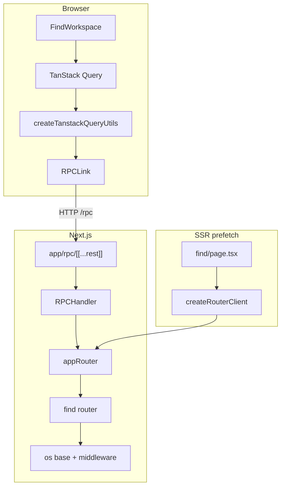

# oRPC + TanStack Query integration

## Problem

Find uses a hybrid transport: abortable search via `GET /api/find/search`, config reads and mutations via Server Actions, all wired into TanStack Query with hand-rolled keys and fetchers. There is no end-to-end typed RPC layer, so adding features means repeating route/action/client boilerplate. We want a single typed HTTP RPC surface with first-class TanStack Query helpers, while keeping Git RSC-only for now.

## Goals

- Install oRPC (`@orpc/server`, `@orpc/client`, `@orpc/tanstack-query`) in `apps/web`.
- Provide a reusable router/client scaffold so future feature routers can plug in without another infra pass.
- Migrate Find fully onto oRPC procedures consumed via `createTanstackQueryUtils`.
- Preserve abortable search-as-you-type, SSR config prefetch without empty flash, and existing Find UX error strings.
- Deep rewrite: typed `.input` / `.output` / `.errors`, shared middleware and context (not thin wrappers over action return unions).

## Scope and decisions

- Scope B: Find migrates now; scaffold ready for later features. Git viewer stays server-component based.
- Transport A: HTTP RPC only (`RPCHandler` at `/rpc` + `RPCLink`). No Server Actions for Find after cutover.
- SSR A: dual client — browser `RPCLink`; server `createRouterClient` (Optimize SSR) for prefetch.
- Style: deep rewrite with shared `os` base, same-origin middleware, typed `ORPCError`s.
- Stay inside `apps/web` (no new API/schema package). No OpenAPI or auth expansion in this pass.

## Architecture



### Dependencies (apps/web)

- `@orpc/server`
- `@orpc/client`
- `@orpc/tanstack-query`

### New files

| File | Purpose |
|---|---|
| `apps/web/lib/orpc/context.ts` | `OrpcContext` (`headers`, optional `signal`) |
| `apps/web/lib/orpc/base.ts` | Shared `os`, common errors, same-origin middleware |
| `apps/web/lib/orpc/router.ts` | `appRouter` composition (`{ find: findRouter }`) |
| `apps/web/app/rpc/[[...rest]]/route.ts` | `RPCHandler` mount |
| `apps/web/lib/orpc/client.ts` | Browser/SSR-fallback `RPCLink` client + TanStack utils |
| `apps/web/lib/orpc/client.server.ts` | `server-only` `createRouterClient` → `globalThis.$client` |
| `apps/web/features/find/orpc.ts` | Find procedures |

### Deleted after cutover

- `apps/web/app/api/find/search/route.ts`
- `apps/web/app/find/actions.ts`
- `apps/web/features/find/client.ts`, `apps/web/features/find/keys.ts`
- Leftover `apps/web/lib/find/*` duplicates if present

## Context and errors

```ts
type OrpcContext = {
  headers: Headers
  signal?: AbortSignal
}
```

Common typed errors on the base: `BAD_REQUEST`, `FORBIDDEN`, `NOT_FOUND`, `RATE_LIMITED` (with `resetAt`), `INTERNAL_SERVER_ERROR`.

Middleware rejects `sec-fetch-site: cross-site` with `FORBIDDEN` (same guard as the former search route).

## Find procedures

| Procedure | Kind | Behavior |
|---|---|---|
| `find.getConfig` | query | `readFindConfig` |
| `find.search` | query | `executeSearch` + `context.signal`; max 50/source |
| `find.addLocalRoot` | mutation | validate path; throw `BAD_REQUEST` on failure |
| `find.removeLocalRoot` | mutation | by id |
| `find.lookupGitHubRepos` | mutation | success `{ repos }`; throw `NOT_FOUND` / `RATE_LIMITED` / `BAD_REQUEST` |
| `find.setGitHubRepoSelection` | mutation | select/deselect |
| `find.syncSelectedGitHubRepos` | mutation | returns `SyncResult[]` (per-repo ok/fail in payload) |

Schemas stay colocated under `features/find` / `features/github`. Search RPC input uses real booleans (not query-string `stringbool`).

## Client / TanStack

- `export const orpc = createTanstackQueryUtils(client)`
- UI uses `orpc.find.*.queryOptions` / `mutationOptions` and `.key()` for invalidation
- Retire hand-rolled `findKeys` and `fetchSearchResults`
- Recent-searches cache merge remains an effect on search success
- Query provider / `makeQueryClient` defaults unchanged

## Out of scope

- Git viewer → oRPC
- OpenAPI handler
- Auth/session beyond forwarding headers
- New shared packages

## Verification

- Typecheck
- Find flows: config prefetch (no flash), abortable search, local roots, GitHub lookup/select/sync, cache invalidation
- Cross-site requests to `/rpc` return forbidden
