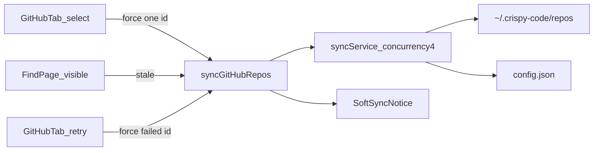

# Auto-sync GitHub repos for Code Finder

## Problem

Code Finder requires a manual Sync click after selecting GitHub repositories. Mirrors go stale until the user syncs again. Setup should feel automatic while staying simple and local.

## Product goals

- Sync a repo as soon as it is selected.
- Refresh mirrors when the Find page loads or becomes visible again, at most once per hour per repo.
- Keep search usable during sync with a soft progress notice.
- Manual sync only as a retry for failed repos.
- Split Sources sheet into Local and GitHub tabs.

## Scope and decisions

- Reuse shallow local mirrors under `~/.crispy-code/repos` and config in `~/.crispy-code/config.json`.
- No GitHub App, webhooks, OAuth, or closed-browser background jobs.
- No private-repo authenticated clone (token remains REST-only).
- Approach: sync service + targeted RPC; client owns triggers.

## Architecture

- Extract clone/fetch/checkout into `syncGitHubRepos` service.
- Expose `find.syncGitHubRepos({ ids?, mode: 'stale' | 'force' })` over oRPC.
- Client triggers force-on-select and stale-on-visit/visibility.
- Sources sheet tabs: **Local** | **GitHub** (replaces Sources | Sync).

## Sync rules

### `mode: 'stale'`

Eligible when:

- `syncedAt` is `null`, or
- `syncedAt` is older than 1 hour

Repos with `syncError` set are skipped (user retries via force).

### `mode: 'force'`

Syncs given `ids` (or all selected if omitted). Ignores the 1-hour window. Clears `syncError` on success.

### Concurrency and results

- Up to 4 repos sync in parallel; config writes stay serialized via `updateFindConfig`.
- Skipped repos are omitted from the RPC result array.
- One client-side in-flight sync; redundant stale calls are dropped while busy.

## UI

- Soft notice on Find: “Syncing N repos…” while a sync is in flight; search stays usable.
- **Local** tab: add/remove local project folders.
- **GitHub** tab: user/org lookup, selection checkboxes, selected list with `syncedAt` / `syncError`, Retry only when failed, remove/trash.
- No always-on bulk Sync button.

## Error handling

- Per-repo git failures set `syncError` and do not block other repos.
- Select succeeds if config write succeeds even if follow-up force sync fails.
- Stale mode never auto-retries failed repos.
- GitHub REST rate-limit handling for lookup is unchanged.

## Testing

Manual smoke only:

1. Select a repo → mirror appears; notice shows then clears; search finds code.
2. Reload Find within an hour → no re-fetch.
3. After `syncedAt` older than 1 hour → visit/visibility refreshes.
4. Force a sync failure → Retry appears; Retry recovers.
5. Sources sheet Local and GitHub tabs each show only their content.

## Out of scope

- Private clone auth / injecting `GITHUB_TOKEN` into git
- Background sync when the browser is closed
- Webhooks / GitHub App
